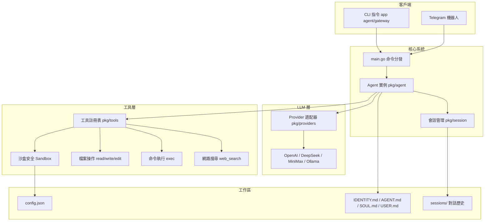
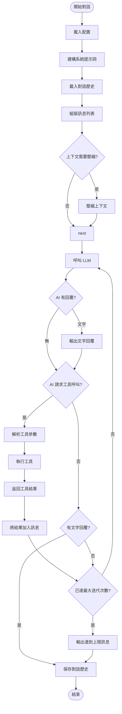
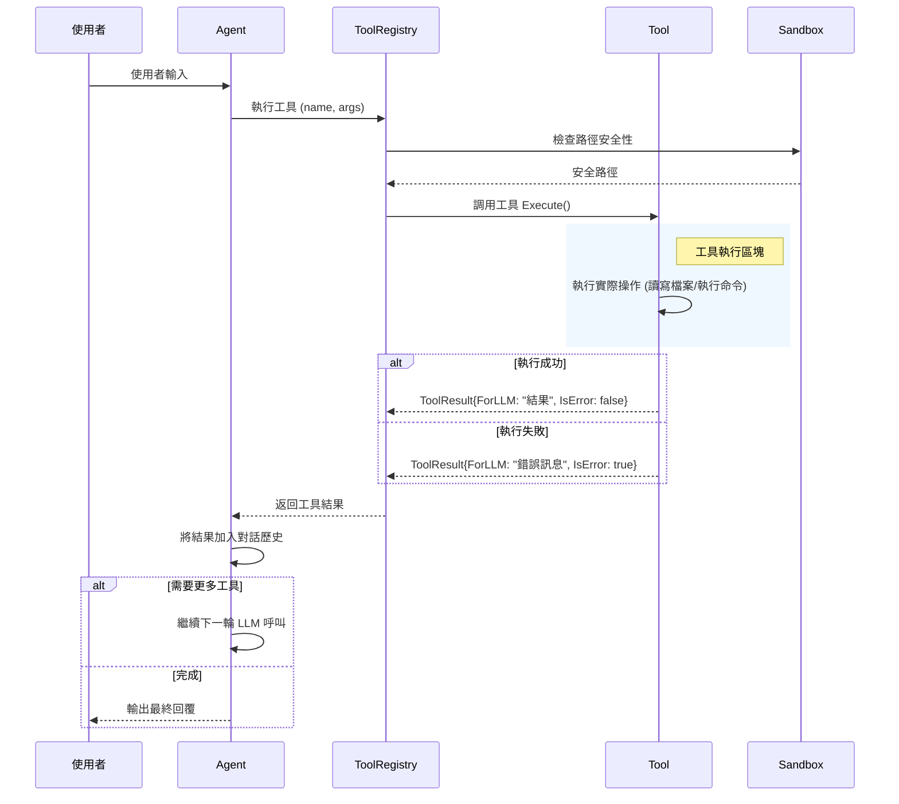
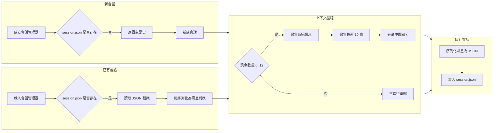
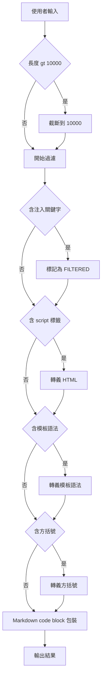

# MiniBot.go 🤖✨

MVP 最小可執行性產品（Minimum Viable Product）的 **MiniBot.go** 是一個極致輕量、無過度依賴的本地端 AI 助理專案。它專注於以極低的資源消耗（📦 單一執行檔 < 15MB、⚡ RAM < 10MB）提供強大的本地工具呼叫與遠端通訊功能。

專案特別針對開發者與技術玩家設計，支援靈活的 LLM 供應商切換（OpenAI、DeepSeek、MiniMax、Ollama 等）以及透過 Telegram 進行隨時隨地的存取。 📱

## 🌟 核心特色
- 🐹 **純 Go 實作**：除了標準函式庫外，零第三方肥大框架依賴。
- 🔧 **本地工具呼叫**：內建 Sandbox 沙箱機制，允許 AI 助理安全地讀寫檔案、瀏覽目錄、執行終端機指令。
- 🔍 **內建網頁搜尋**：透過 DuckDuckGo API，即使不設定額外的 Search API Key 也能讓 AI 上網找資料。
- 🤝 **多供應商支援**：採用 OpenAI 的通訊協定標準化介面，可無縫對接 OpenAI、Ollama、MiniMax、Groq 等各式各大廠 API。
- 🚀 **跨平台與容器化**：支援 Linux / Windows / macOS 交叉編譯，並提供極小型的 Alpine Dockerfile 部署方案。
- 📲 **Telegram 整合**：內建 Long Polling 接收器與白名單過濾機制，保護隱私。

---

## 🏗️ 系統架構流程圖

> [!TIP]
> 以下架構圖使用 [Mermaid](https://mermaid.js.org/) 語法繪製。
> - **本地預覽**：請在 VS Code / Antigravity 中安裝插件
>   [`Markdown Preview Mermaid Support`](https://marketplace.visualstudio.com/items?itemName=bierner.markdown-mermaid)（`bierner.markdown-mermaid`），
>   再使用 **Markdown 預覽**（`Ctrl+Shift+V`）即可正確顯示圖表。
> - **GitHub**：無需任何設定，圖表在 GitHub 網頁上原生支援自動渲染。

### 整體架構圖


### Agent 執行流程 (ReAct Loop)


### 工具呼叫詳細流程


---

## 🚀 快速開始

### 📦 1. 安裝與編譯
請確保您的系統已安裝 **Go 1.21+**。

```bash
git clone https://github.com/chiisen/mini_bot.git
cd mini_bot
# 透過 Makefile 編譯 (Windows 環境可直接執行 `go build -o app.exe ./cmd/appname/`)
make build
```

### 🛠️ 2. 環境初始化 (Onboard)
編譯完成後，執行 `onboard` 指令來建立工作區 (Workspace) 與設定檔：

```bash
./app onboard
```
此指令將會：
- 📥 互動式地詢問你的 API Token。
- 📂 在使用者的家目錄建立 `~/.minibot.go/` 資料夾。
- 📝 產生 `config.json` 設定檔。
- ✨ 初始化 `workspace/` 底下的 Agent 人格模板 (`IDENTITY.md`, `AGENT.md`, `SOUL.md`, `USER.md`)。

### ⚙️ 3. 設定 Config.json
若您在 Onboard 階段漏設定 API 金鑰或想改用其他的模型供應商，請編輯 `~/.minibot.go/config.json`：

```json
{
  "agents": {
    "defaults": {
      "workspace": "~/.minibot.go/workspace",
      "model": "minimax/MiniMax-M2.5",         // 指定優先使用的供應商與模型
      "maxTokens": 8192,
      ...
    }
  },
  "providers": {
    "minimax": {
      "apiKey": "your-minimax-api-key",
      "apiBase": "https://api.minimax.io/v1"
    },
    "openai": {
      "apiKey": "sk-...",
      "apiBase": "https://api.openai.com/v1"
    }
  },
  "channels": {
    "telegram": {
      "enabled": true,
      "botToken": "YOUR_TELEGRAM_BOT_TOKEN",
      "allow_from": ["YOUR_TELEGRAM_USER_ID"]  // 安全性白名單，非此 ID 的訊息將被拒絕
    }
  }
}
```

> 💡 **注意**：Provider 名稱必須與 `agents.defaults.model` 的前綴對應。例如 `minimax/MiniMax-M2.5` 會對應到 `providers.minimax`。

---

## 🎮 使用方式

MiniBot.go 提供了三種主要的操作模式。

你可以隨時透過 `status` 指令檢查環境是否健康：
```bash
./app status
```

### 🎯 模式一：單次指令問答 (Single Shot)
快速向機器人發出一個問題或指令並結束：
```bash
./app agent -m "請幫我用 python 寫一個 hello world 檔案"
```

### 💬 模式二：本地互動式對話 (Interactive Mode)
啟動對話迴圈，適合複雜任務的協作（輸入 `exit` 離開）：
```bash
./app agent
```
```
🚀 MiniBot.go Interactive Mode Started (type 'exit' or 'quit' to leave)
You: 幫我列出目錄下的檔案
Agent: [Agent uses tool: list_dir...]
Agent: 根目錄底下有...
```

### 🌐 模式三：啟動對外伺服器 (Gateway Mode)
啟動背景常駐程式，此模式會掛載 `Telegram` 的長輪詢事件，讓您可以透過手機的 Telegram 直接與機器人互動：
```bash
./app gateway
```

---

## 🛠️ 目錄結構與架構
- 📂 `cmd/appname/`：CLI 指令的進入點 (main, agent, gateway, onboard, status)。
- 🧠 `pkg/agent/`：Agent 的大腦核心，負責上下文建構、指令壓縮與 Tool Calling 的思考迴圈。
  - > ⚠️ **注意**：`loop.go` 的 `Run()` 方法需要 Mock LLMProvider 才能完整測試（需要 mock 模擬 AI 回應），因涉及 API 呼叫會產生費用，暫不製作。

> 📝 **待完成事項**：部分單元測試（`pkg/providers/`、`pkg/agent/`）需要 mock Go SDK 工具才能執行。這是因為 `pkg/tools/shell.go` 使用 `exec.Command` 動態執行 Go 程式碼來分析專案結構，在隔離測試環境中無法運行。建議未來使用介面模擬（interface mock）方式解決。
- 📡 `pkg/channels/`：頻道管理器與 Telegram 整合。
- 🧰 `pkg/tools/`：沙箱、檔案操作與命令列操作之本機工具實作。
- 🔌 `pkg/providers/`：各大 LLM 廠商的相容適配層。
- ⚙️ `pkg/config/`：配置檔定義與預設值讀寫。
- 📜 `pkg/session/`：對話歷史的持久化、記錄與載入。

## 🔐 安全性與 Sandbox
請妥善管理 `agents.defaults.restrictToWorkspace` 參數。若為 `true`，AI 將被禁止讀寫 `~/.minibot.go/workspace` 目錄以外的所有磁碟路徑，並對危險指令 (如 `rm -rf /` 等) 進行封鎖，避免對您的系統造成潛在破壞。 🛡️

### 對話會話管理流程


### 輸入安全處理流程


